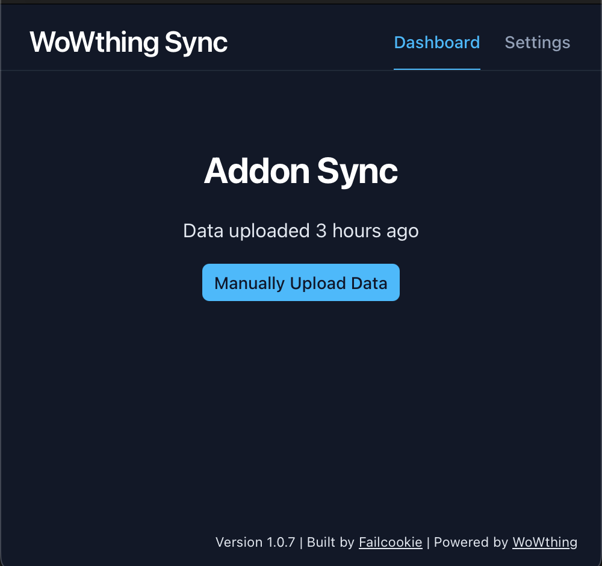

# Wowthing Sync

Wowthing Sync is a cross-platform desktop client for [Wowthing](https://wowthing.org/) that keeps your addon data in sync with the web app. It runs natively on macOS, Windows, and Linux/Steam Deck using Tauri and Nuxt.



## Download

| Platform | Link |
| --- | --- |
| macOS (Apple Silicon) | https://calebsmithdev.github.io/wowthing-sync/download/mac-silicon |
| macOS (Intel) | https://calebsmithdev.github.io/wowthing-sync/download/mac-intel |
| Windows (x64) | https://calebsmithdev.github.io/wowthing-sync/download/windows |
| Linux (x64) | https://calebsmithdev.github.io/wowthing-sync/download/linux |

## Features

- Automatically upload the [Wowthing Collector](https://www.curseforge.com/wow/addons/wowthing-collector) addon data on character reload/logout
- Manually upload addon data on demand

## How to Develop

### Prerequisites

- Node.js ≥ 22
- Rust toolchain with the targets required by [Tauri's platform prerequisites](https://tauri.app/start/prerequisites/)
- npm (bundled with Node) and the platform-specific Tauri dependencies for your OS

### Install dependencies

```bash
npm install --prefix ./apps/desktop
```

### Start the desktop app in development mode

```bash
npm run --prefix ./apps/desktop dev
```

This launches the Nuxt dev server and the Tauri shell with hot reload.

### Run tests

```bash
npm run --prefix ./apps/desktop test:unit
cargo test --manifest-path apps/desktop/src-tauri/Cargo.toml
```

### Build a release installer (current OS)

```bash
npm run --prefix ./apps/desktop build
npm run --prefix ./apps/desktop tauri build
```

## Scripts

- `scripts/clean-build-artifacts.sh`: Removes Nuxt and Tauri build artifacts (Cargo `target`, `.nuxt`, `.output`, `.npm-cache`, `dist`, etc.) to reclaim disk space. Run `./scripts/clean-build-artifacts.sh --dry-run` to preview deletions before executing the full cleanup.

## Other information

For marketing site updates, see the Nuxt project in `marketing/` and deploy the generated `marketing/dist/` contents to your static host of choice.
