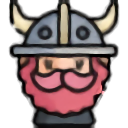
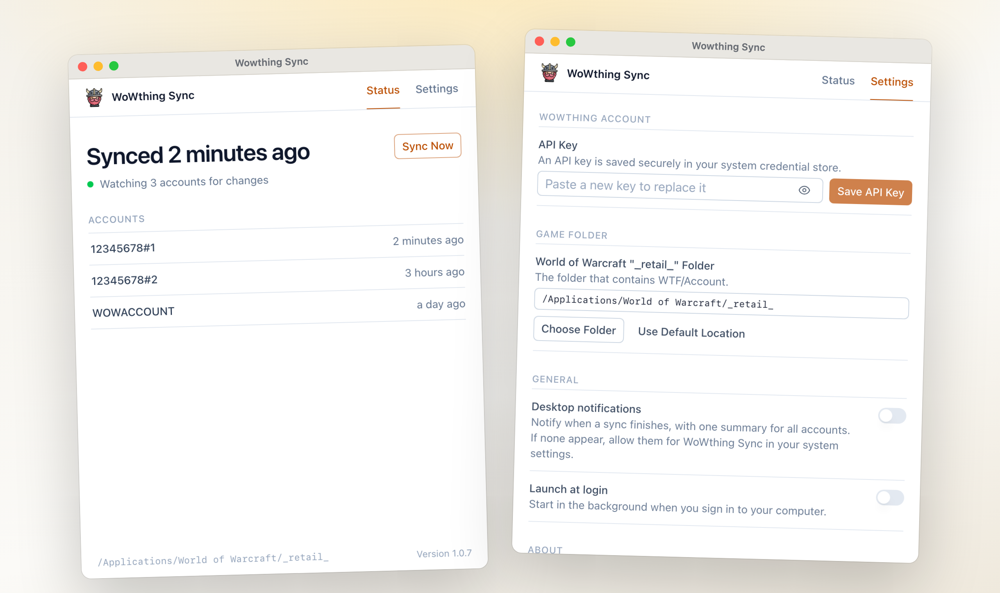
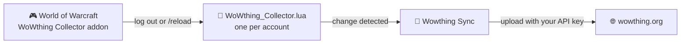
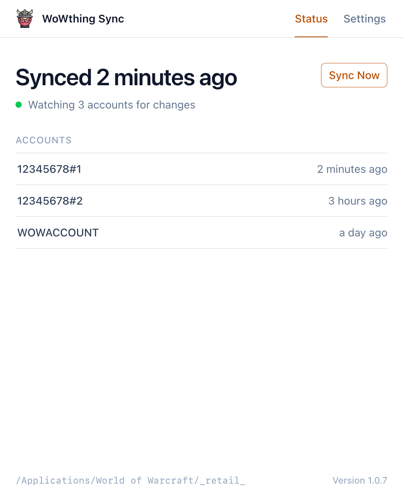
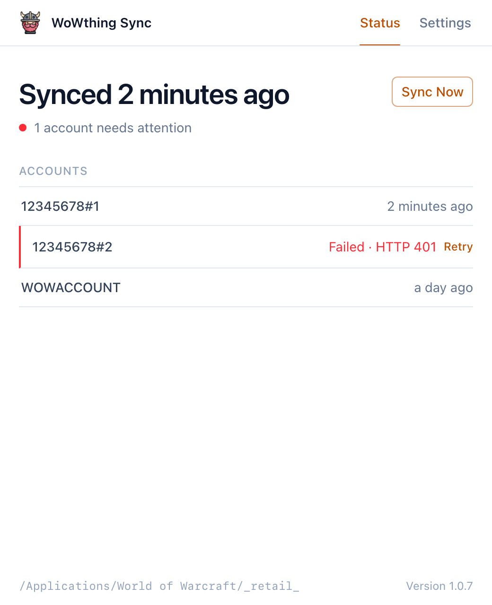
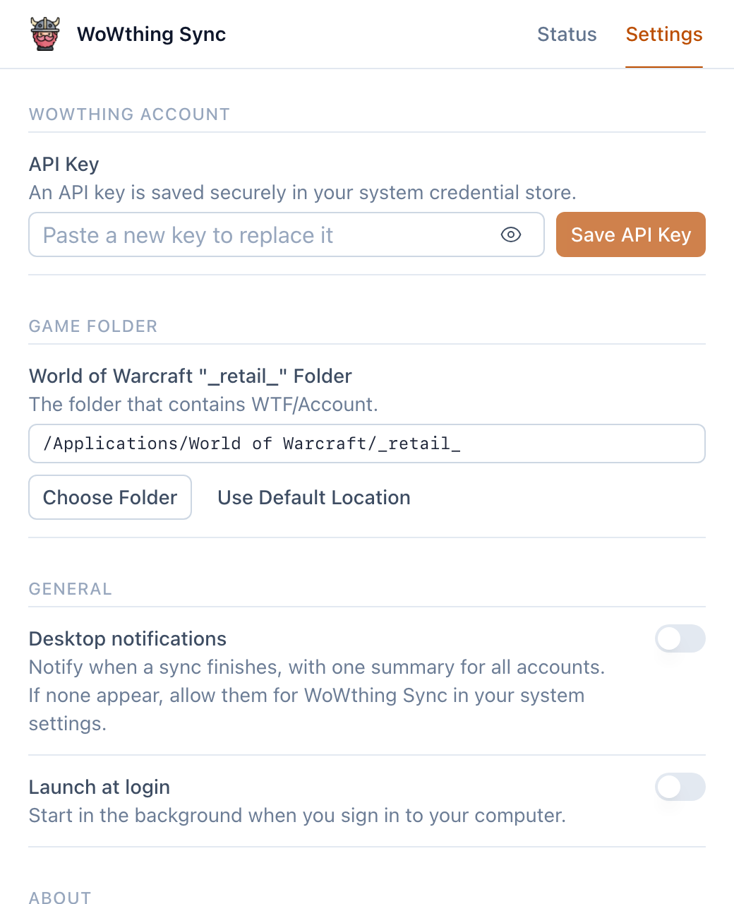

<div align="center">



# Wowthing Sync

**Keep [WoWthing](https://wowthing.org/) up to date without opening a browser.**<br>
A small desktop app that uploads your WoWthing Collector addon data each time you log out.

[](https://github.com/calebsmithdev/wowthing-sync/releases/latest)
[](https://github.com/calebsmithdev/wowthing-sync/actions/workflows/rust-tests.yml)
[](LICENSE)


[**Download**](#download) · [Getting started](#getting-started) · [Screenshots](#screenshots) · [Development](#development)

<br>

<picture>
  <source media="(prefers-color-scheme: dark)" srcset="assets/readme/hero-dark.png">
  
</picture>

</div>

## What it does

[WoWthing](https://wowthing.org/) tracks your characters, collections and progress across every
World of Warcraft account you own. Its [WoWthing Collector](https://www.curseforge.com/wow/addons/wowthing-collector)
addon records that data in your game's `SavedVariables` whenever a character logs out or reloads the UI.
Wowthing Sync watches those files and uploads each new version to WoWthing for you.


```mermaid
flowchart LR
    A["🎮 World of Warcraft<br/>WoWthing Collector addon"] -- "log out or /reload" --> B["📄 WoWthing_Collector.lua<br/>one per account"]
    B -- "change detected" --> C["🔄 Wowthing Sync"]
    C -- "upload with your API key" --> D["🌐 wowthing.org"]
```

- **Set it and forget it.** Runs in the system tray and can start when you sign in. Changes are uploaded a moment after the game finishes writing them.
- **Every account at a glance.** See when each account last uploaded. If one fails, the error and a Retry button appear on that account's row.
- **Sync Now, from anywhere.** Trigger an upload from the window or the tray menu, which also shows the current sync status.
- **One notification per sync.** Optional desktop notifications summarize the whole sync, for example "Collector data uploaded for 3 accounts".
- **Secure by default.** Your API key is stored in your system's credential store (Keychain, Windows Credential Manager or Secret Service), never in a plain-text file.
- **Stays current.** Signed automatic updates, plus light and dark themes that follow your system.

## Download

| Platform | Download |
| --- | --- |
| macOS (Apple Silicon) | [Download for Apple Silicon](https://calebsmithdev.github.io/wowthing-sync/download/mac-silicon) |
| macOS (Intel) | [Download for Intel Macs](https://calebsmithdev.github.io/wowthing-sync/download/mac-intel) |
| Windows 10/11 (x64) | [Download for Windows](https://calebsmithdev.github.io/wowthing-sync/download/windows) |
| Linux (x64, including Steam Deck) | [Download the AppImage](https://calebsmithdev.github.io/wowthing-sync/download/linux) |

Each link downloads the latest build for that platform. All releases, including older versions, are on the [Releases page](https://github.com/calebsmithdev/wowthing-sync/releases).
Once installed, the app updates itself.

> [!NOTE]
> On Linux, the app stores your API key with the Secret Service (GNOME Keyring, KWallet and similar),
> so a keyring must be running. Most desktop environments, including Steam Deck desktop mode, provide one.

## Getting started

1. **Install the addon.** Add [WoWthing Collector](https://www.curseforge.com/wow/addons/wowthing-collector) to your retail game with your addon manager of choice.
2. **Copy your API key.** Sign in to [wowthing.org](https://wowthing.org/), open **Settings → Account** and copy your API key.
3. **Connect the app.** In Wowthing Sync, open **Settings**, paste the key and select **Save API Key**.
4. **Pick your game folder.** Select **Use Default Location**, or **Choose Folder** and pick the `_retail_` folder inside your World of Warcraft installation.
5. **Play.** Log out of a character (or `/reload`). Its account shows up under **Status** with an upload time a few seconds later.

<details>
<summary><b>Where is my <code>_retail_</code> folder?</b></summary>

| System | Default location |
| --- | --- |
| macOS | `/Applications/World of Warcraft/_retail_` |
| Windows | `C:\Program Files (x86)\World of Warcraft\_retail_` |
| Linux (Wine or Lutris) | `~/.wine/drive_c/Program Files (x86)/World of Warcraft/_retail_` or `~/Games/world-of-warcraft/drive_c/Program Files (x86)/World of Warcraft/_retail_` |

The folder you pick must contain `WTF/Account`. **Use Default Location** checks these paths for you.
</details>

## Screenshots

<table>
  <tr>
    <td width="33%" align="center">
      <picture>
        <source media="(prefers-color-scheme: dark)" srcset="assets/readme/status-dark.png">
        
      </picture>
      <br><sub><b>Status</b>: when each account last uploaded</sub>
    </td>
    <td width="33%" align="center">
      <picture>
        <source media="(prefers-color-scheme: dark)" srcset="assets/readme/failure-dark.png">
        
      </picture>
      <br><sub><b>Failures</b>: shown on the affected account, with Retry</sub>
    </td>
    <td width="33%" align="center">
      <picture>
        <source media="(prefers-color-scheme: dark)" srcset="assets/readme/settings-dark.png">
        
      </picture>
      <br><sub><b>Settings</b>: API key, game folder, notifications and launch at login</sub>
    </td>
  </tr>
</table>

## Privacy and security

- The app reads only `WTF/Account/<account>/SavedVariables/WoWthing_Collector.lua` files inside the folder you choose. It doesn't read other addons' data or anything outside that folder.
- Collector data is sent only to wowthing.org, using your API key.
- The API key is kept in your operating system's credential store and is never shown in the app or written to logs.
- Updates are signed and verified before they're installed.

## Troubleshooting

| Problem | What to try |
| --- | --- |
| An account shows **Failed · HTTP 401** | Your API key was rejected. Copy it from WoWthing again and save it in **Settings**. |
| "No collector files found" | Make sure the WoWthing Collector addon is enabled, log out of a character once, then choose the `_retail_` folder again. |
| No desktop notifications | Turn on **Desktop notifications** in Settings, then allow notifications for Wowthing Sync in your system settings. |
| Credential store errors on Linux | Start your keyring (for example GNOME Keyring or KWallet), then select **Retry Sync**. |

Still stuck? [Open an issue](https://github.com/calebsmithdev/wowthing-sync/issues) and describe what you see in the app.

## Development

Wowthing Sync is built with [Tauri 2](https://tauri.app/) (Rust) and [Nuxt 4](https://nuxt.com/) with [Nuxt UI](https://ui.nuxt.com/) (Vue and TypeScript).
Rust handles everything that touches the operating system: watching files, uploading, the credential store, autostart and notifications.
Vue only renders the interface.

### Prerequisites

- **Node.js** 22.22.3+, 24.15.0+ or 26+ (CI uses 22.22.3)
- **Rust 1.97.1**, installed automatically from `rust-toolchain.toml` by `rustup`
- The [Tauri system dependencies](https://tauri.app/start/prerequisites/) for your operating system

### Quick start

```bash
git clone https://github.com/calebsmithdev/wowthing-sync.git
cd wowthing-sync
npm ci --prefix apps/desktop
npm run --prefix apps/desktop tauri:dev
```

`tauri:dev` starts a local Nuxt dev server on port 3015 (hot reload on 3016) and opens the app with a development Content Security Policy.
If that port is in use, set `TAURI_DEV_PORT` to a free one.

> [!WARNING]
> The development app uses your real preferences and OS credential store. Use the test commands below,
> which run against isolated fixtures, instead of the normal app when you verify changes.

### Project layout

```text
apps/desktop/
├── src/                # Nuxt app: pages, components, composables
├── src-tauri/src/      # Rust: sync service, settings, credentials, tray
└── tests/              # Vitest unit tests, Playwright smoke, native test scripts
marketing/              # Download site (GitHub Pages)
scripts/                # Dev, test, packaging and release tooling
docs/                   # CI validation and dependency notes
```

### Testing

```bash
# Frontend
npm run --prefix apps/desktop lint
npm run --prefix apps/desktop typecheck
npm run --prefix apps/desktop test:unit

# Rust (build the frontend first; the native app embeds it)
npm run --prefix apps/desktop generate
cargo fmt --all -- --check
cargo clippy --locked --all-targets -- -D warnings
cargo test --locked

# The UI in Chromium, and in your system's real webview
cd apps/desktop
npx playwright install chromium
npm run test:e2e
npm run test:native   # on Linux: xvfb-run -a npm run test:native
```

The browser and native smoke tests use synthetic fixtures. They never touch your settings or credentials, and never upload anything.

<details>
<summary><b>What the test layers cover</b></summary>

- **`test:e2e`** serves the built frontend with a strict CSP and a fake Tauri bridge, then exercises settings, sync status, failures and update states in Chromium.
- **`test:native`** builds the app with the `smoke-test` feature, which replaces all native services with fixtures. It runs the real webview (WKWebView, WebView2 or WebKitGTK) with the production CSP.
- **`test:integration`** drives the real sync worker, settings commands, window lifecycle and updater cleanup against a local HTTP server.
- **`cargo test`** covers file discovery and path-safety checks, the upload queue and retries, settings persistence, and a real sync worker running against a local server.

CI runs all of these on macOS (Apple Silicon and Intel), Windows and Linux.
See [docs/ci-validation.md](docs/ci-validation.md) for the full matrix, and [AGENTS.md](AGENTS.md) for the command catalog and security boundaries.
</details>

### Building

```bash
# A debug build for your current OS (no signing credentials needed)
npm run --prefix apps/desktop tauri -- build --debug --no-bundle -- --locked

# An unsigned macOS .app bundle
npm run --prefix apps/desktop tauri -- build --debug --bundles app --no-sign \
  --config '{"bundle":{"createUpdaterArtifacts":false}}' -- --locked
```

The app version comes from `apps/desktop/src-tauri/Cargo.toml`. Releases are built, signed and drafted by the
[Publish Release](.github/workflows/release.yml) workflow. `scripts/clean-build-artifacts.sh --dry-run` previews
what the cleanup script would delete to reclaim disk space.

<details>
<summary><b>Download site</b></summary>

The download links above come from the Nuxt site in `marketing/`:

```bash
npm ci --prefix marketing
npm run generate --prefix marketing   # outputs marketing/.output/public
```

It is deployed by the [Deploy to GitHub Pages](.github/workflows/static-pages.yml) workflow.
</details>

## Contributing

Issues and pull requests are welcome. Before opening a PR, run the checks under [Testing](#testing),
and include a screenshot if you changed the UI. [AGENTS.md](AGENTS.md) describes the conventions this repository follows.

## License and credits

Released under the [GNU GPL v3.0](LICENSE). Built by [Failcookie](https://wowthing.org/user/Failcookie). Powered by [WoWthing](https://wowthing.org/).

Wowthing Sync is a community project and is not affiliated with or endorsed by Blizzard Entertainment.
World of Warcraft is a trademark of Blizzard Entertainment, Inc.
