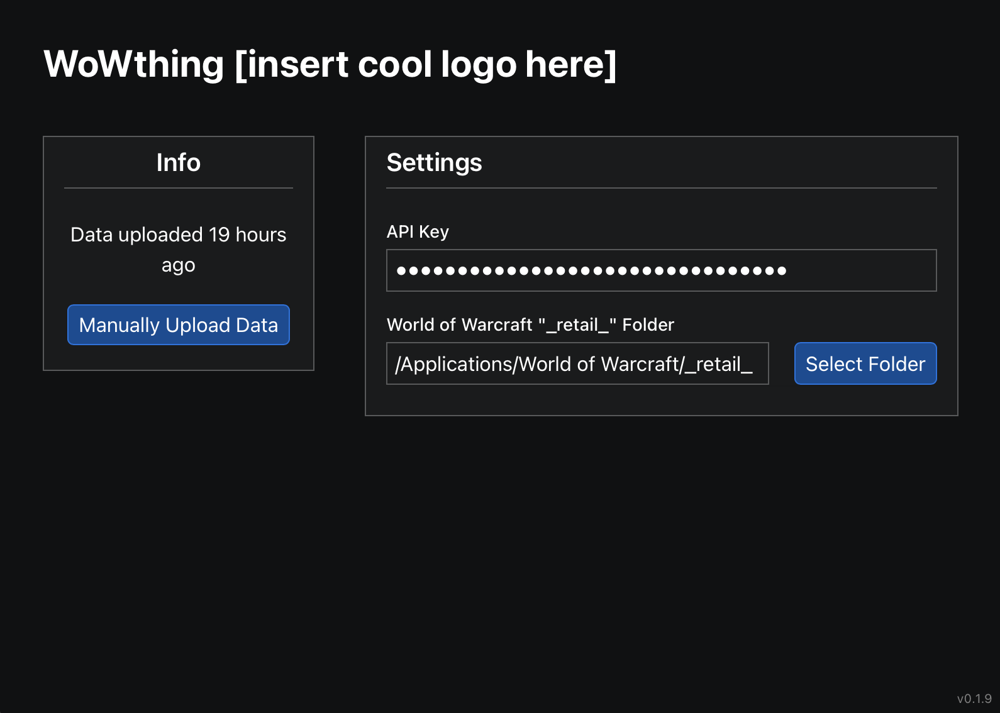

# Wowthing Sync

Wowthing Sync is a cross-platform desktop client for [Wowthing](https://wowthing.org/) that keeps your addon data in sync with the web app. It runs natively on macOS, Windows, and Linux/Steam Deck using Tauri and Nuxt.



## Download

| Platform | Link |
| --- | --- |
| macOS (Apple Silicon) | [WowthingSync-AppleSilicon.dmg](https://calebsmithdev.github.io/wowthing-sync/download/mac-silicon) |
| macOS (Intel) | [WowthingSync-Intel.dmg](https://calebsmithdev.github.io/wowthing-sync/download/mac-intel) |
| Windows (x64) | [WowthingSync.msi](https://calebsmithdev.github.io/wowthing-sync/download/windows) |
| Linux (x64) | [WowthingSync.AppImage](https://calebsmithdev.github.io/wowthing-sync/download/linux) |

## Features

- Automatically upload the [Wowthing Collector](https://www.curseforge.com/wow/addons/wowthing-collector) addon data on character reload/logout
- See when each account last uploaded, with failures and Retry shown on that account
- Sync Now from the app or the tray menu, which also shows the current sync status
- Save API keys securely in OS credential storage; a folder chosen in the folder picker is validated and saved immediately
- View failures for each account and retry locked credential connections in the app
- Follows your system's light or dark appearance

## How to Develop

### Prerequisites

- Node.js 22.22.3+, 24.15.0+, or 26+ (matching Nuxt's supported release lines)
- Rust **1.97.1** (pinned in `rust-toolchain.toml`) and targets required by [Tauri's platform prerequisites](https://tauri.app/start/prerequisites/)
- npm (bundled with Node) and the platform-specific Tauri dependencies for your OS

### Install dependencies

```bash
npm ci --prefix ./apps/desktop
```

### Start the desktop app in development mode

```bash
npm run --prefix ./apps/desktop tauri:dev
```

This launches a loopback Nuxt dev server and Tauri shell with hot reload and fresh CSP nonces on port3015 (HMR3016). Busy ports are refused; choose another with `TAURI_DEV_PORT`. Avoid running the normal app for tests: it opens your real preferences and OS credentials.

### Run tests

```bash
npm run --prefix ./apps/desktop lint
npm run --prefix ./apps/desktop typecheck
npm run --prefix ./apps/desktop test:unit
npm run --prefix ./apps/desktop generate
cargo fmt --all -- --check
cargo clippy --locked --all-targets -- -D warnings
cargo test --locked
cargo check --locked
node --test scripts/*.test.mjs
cd apps/desktop
npx playwright install chromium
npm run test:e2e
npm run test:native
```

### Build locally (current OS, no distribution credentials)

```bash
npm run --prefix ./apps/desktop tauri -- build --debug --no-bundle -- --locked
# macOS app bundle:
npm run --prefix ./apps/desktop tauri -- build --debug --bundles app --no-sign --config '{"bundle":{"createUpdaterArtifacts":false}}' -- --locked
```

Browser smoke serves built assets with a hermetic Tauri adapter and strict CSP. Native smoke uses the compile-time `smoke-test` builder with synthetic commands: it never accesses your settings, credentials, uploads or live updater. It checks actual WKWebView/WebView2/WebKitGTK boot, CSP and IPC; it does not test OS credential prompts, autostart, notifications, tray menus or signed installation. Linux native smoke needs `xvfb-run -a npm run test:native`. macOS uses in-process automation because tauri-driver does not support WKWebView. Windows/Linux/Intel macOS execution is configured in CI but was not executed on this development machine.

Cargo package version is authoritative. `scripts/release-metadata.mjs` validates input, tag, lockfile, app and signed updater metadata before creating/resuming a matching draft release. No release is published automatically by development commands. Distribution signing credentials are needed only for release artifacts.

The selected `_retail_` folder must contain `WTF/Account` and readable nonempty collector files. Only bounded account `SavedVariables/WoWthing_Collector.lua` files inside that root can upload. Legacy keys migrate only after verified OS credential save; unavailable/locked storage is recoverable with **Retry Sync**. Linux needs a running Secret Service. If startup preferences are unreadable or invalid, repair/restore the file and restart the app; Retry Loading Settings recovers transient bridge errors. Desktop notification consent is reported as unknown because the native API cannot reliably expose OS delivery settings.

See [AGENTS.md](AGENTS.md) for the exact command catalog, security boundaries and platform test matrix.

## Scripts

- `scripts/clean-build-artifacts.sh`: Removes Nuxt and Tauri build artifacts (Cargo `target`, `.nuxt`, `.output`, `.npm-cache`, `dist`, etc.) to reclaim disk space. Run `./scripts/clean-build-artifacts.sh --dry-run` to preview deletions before executing the full cleanup.

## Other information

For marketing site updates, run `npm ci --prefix marketing` and `npm run generate --prefix marketing`, then deploy `marketing/.output/public/` to your static host of choice.

See [the dependency review](docs/dependency-review.md) for upgrade decisions, validation, and outstanding upstream advisories.
